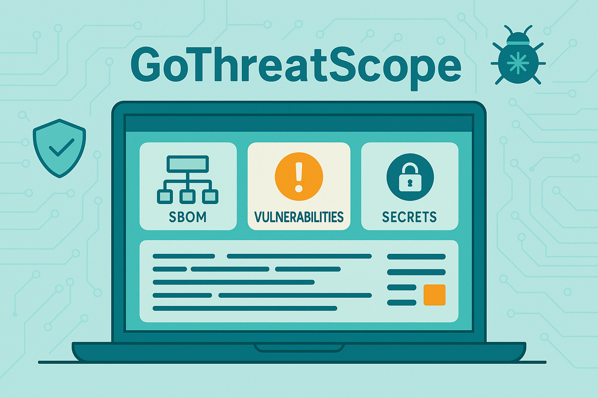

<p align="center">
  
</p>

# GoThreatScope

**GoThreatScope** is a modular, educational security toolchain written in Go.  
It generates a lightweight SBOM, checks dependencies against [osv.dev](https://osv.dev) for vulnerabilities and known malicious packages, scans for hardcoded secrets (using [Gitleaks](https://github.com/gitleaks/gitleaks) when available, or a builtin fallback), and records metrics for each run (using [pipedream](https://pipedream.com/)).

This tool also acts as a **Model Context Protocol (MCP)** server, allowing IDEs such as **Cursor** or **Visual Studio Code** to query its results using natural language.  
For example, you can ask:

> "Analyze my project and show me which dependencies look risky."

The MCP interface exposes tools and resources so other systems or LLMs can retrieve structured SBOMs, vulnerability reports, and secret findings directly from the local filesystem.

## Overview

GoThreatScope performs an high-level security inspection of a project directory and organizes the results for both human and automated analysis.

It combines several capabilities into a single workflow:

- **SBOM generation**: creates a simple inventory of project dependencies.  
- **Vulnerability and malware detection**: checks each dependency against [osv.dev](https://osv.dev) to identify known vulnerabilities and malicious packages.  
- **Secrets detection**: searches for API keys, passwords, and private tokens using [Gitleaks](https://github.com/gitleaks/gitleaks) or a simple builtin fallback scanner.  
- **Metrics collection**: stores structured metrics for every run, allowing comparison between scans (configured with [pipedream](https://pipedream.com/)).

Each module works independently or as part of the `analyze` pipeline.  
All results are stored locally under `gothreatscope_store/` and reused when no changes are detected.

## Architecture

GoThreatScope is organized into clear, modular packages.  
Each package handles a specific security function or integration point, making the tool easy to extend or reuse in other projects.

```text
GoThreatScope
│
├── cmd/gothreatscope/         # CLI entrypoint and MCP server mode
│   └── main.go                # CLI commands and MCP wiring
│
├── pkg/
│   ├── sbom/                  # SBOM generation logic
│   ├── vuln/                  # OSV-based vulnerability and malware detection
│   ├── secrets/               # Gitleaks and builtin secret scanner
│   ├── analysis/              # Full pipeline and storage/diff logic
│   ├── metrics/               # Local and remote metrics sender
│   └── mcp/                   # MCP tools and resources implementation
│
└── gothreatscope_store/       # Automatically generated per-project store
    └── <project_id>/
        ├── latest/
        │   ├── sbom.json
        │   ├── vuln.json
        │   ├── secrets.json
        │   ├── metrics.json
        │   └── bundle.json
        └── history/<run_id>/
```

Each project scanned by GoThreatScope receives its own identifier, derived from the SHA-256 hash of its absolute path.
All results are written into that project’s folder under gothreatscope_store/, and new files are only created when differences are detected compared to the previous run.

## How It Works

GoThreatScope operates through independent modules that can run individually or together as part of a complete analysis pipeline.

### 1. Project identification
Every scanned project is assigned a unique identifier derived from the SHA-256 hash of its absolute path.  
This ensures consistent tracking across runs without revealing directory names.

### 2. Persistent storage
Scan results are stored under the `gothreatscope_store/` directory, grouped by project ID.  
Each module writes its own JSON artifact inside a `latest/` folder, and keeps a short history of past results.

```text
gothreatscope_store/
└── a93bf44e3e9c/
    ├── latest/
    │   ├── sbom.json
    │   ├── vuln.json
    │   ├── secrets.json
    │   └── metrics.json
    └── history/20251007T215959Z/
```

### 3. Change detection

Before saving, GoThreatScope compares digests (hashes) of the new results with those from the previous run.
If there are no changes, the stored files remain untouched, avoiding redundant writes and unnecessary history entries.

### 4. Metrics and telemetry

Each scan produces a `metrics.json` file summarizing timing, findings, and environment details.
Metrics are always stored locally and can optionally be sent to a remote endpoint defined by the `GOTHREATSCOPE_METRICS_URL` variable.

### 5. MCP integration

When running in `--mcp` mode, GoThreatScope exposes its analysis capabilities as tools that can be invoked directly by LLMs or IDEs.
Results are returned as structured JSON with `file://` URIs pointing to saved artifacts, allowing the calling system to read or display them without rerunning scans.

## Installation

### Prerequisites

- Go 1.21 or newer  
- (Optional) [Gitleaks v8+](https://github.com/gitleaks/gitleaks) for extended secret detection  

### Installation from source

```bash
go install github.com/anotherik/gothreatscope/cmd/gothreatscope@latest
```

After installation, the binary gothreatscope will be available in your $GOBIN path.

### Local Build

```bash
# Navigate to the project directory
cd /path/to/GoThreatScope

# Build the binary
go build -o ./bin/gothreatscope ./cmd/gothreatscope

# Make it executable
chmod +x ./bin/gothreatscope
```

### Optional environment variables

| Variable | Description | Default |
|-----------|-------------|----------|
| `GOTHREATSCOPE_METRICS_URL` | Remote endpoint for telemetry collection | Built-in demo URL |
| `GTS_KEEP_HISTORY` | Number of history snapshots to keep per project | `1` |
| `GTS_DISABLE_METRICS` | Disable remote metrics (store metrics locally only) | unset |
| `GTS_MCP_MODE` | Enables MCP mode (reduces verbose output) | `1` |
| `GTS_QUIET` | Reduces output verbosity | `1` |
| `GTS_DEBUG` | To enable debug logging | `0` |

If `Gitleaks` is not installed, GoThreatScope automatically uses its internal secret-scanning engine.

## CLI Usage

GoThreatScope can be used directly from the command line to perform individual scans or run the full analysis pipeline.

```bash
# Generate a Software Bill of Materials (SBOM)
gothreatscope sbom --path ./project

# Check dependencies for vulnerabilities and malicious packages
gothreatscope vuln --path ./project

# Scan for hardcoded secrets
gothreatscope secrets --path ./project [--engine auto|gitleaks|builtin]

# Run the complete pipeline (SBOM + Vulnerabilities + Secrets)
gothreatscope analyze --path ./project

# Display version and global help
gothreatscope --version
gothreatscope --help
```

Each command stores its results under `gothreatscope_store/<project_id>/latest/` and updates them only if new findings are detected.
This makes it easy to keep long-term records of project scans without unnecessary reprocessing.

## MCP Server Mode

GoThreatScope can also run as a **Model Context Protocol (MCP)** server, allowing IDEs or LLMs to interact with its analysis results through structured JSON responses.

### What is MCP?

The Model Context Protocol (MCP) is a standard that allows AI assistants to securely connect to data sources and tools. GoThreatScope implements an MCP server that exposes security analysis tools to IDEs like Cursor.

To start the server:

```bash
gothreatscope --mcp
```

When running in MCP mode, GoThreatScope exposes several tools and resources that can be invoked programmatically or through compatible editors such as Cursor or VS Code (with MCP support).

### Available tools

| Tool | Description |
|------|--------------|
| `analyzeRepo` | Runs the full pipeline (SBOM → Vulnerabilities → Secrets). |
| `scanRepoSBOM` | Generates an SBOM and returns its file URI. |
| `vulnCheck` | Checks for vulnerabilities and malicious packages using osv.dev. |
| `secretScan` | Scans for secrets (using Gitleaks or the builtin engine). |

### Available resources

- `resources/list` lists all stored artifacts across scanned projects.  
- `resources/read` retrieves the content of a specific file via a `gts://` URI.

### Example MCP output

```json
{
  "uri": "file:///home/user/gothreatscope_store/a93bf44e3e9c/latest/vuln.json",
  "changed": true,
  "counts": { "vulns": 5 },
  "note": "Vulnerability report updated (change detected)"
}
```

Using these endpoints, IDEs or connected LLMs can request analysis results, open the corresponding JSON artifacts, or cross-reference findings without rerunning the scans.

## Example Integration (Cursor)

GoThreatScope can be used directly inside **Cursor** or any IDE that supports the **Model Context Protocol (MCP)**.

Once installed, configure Cursor to recognize GoThreatScope as an MCP server:

**Option A: Global Configuration**
Add to your Cursor settings (File → Preferences → Settings → Extensions → MCP):

```json
{
  "mcpServers": {
    "gothreatscope": {
      "command": "/absolute/path/to/gothreatscope",
      "args": ["--mcp"],
      "env": {
        "GTS_MCP_MODE": "1"
      }
    }
  }
}
```

**Option B: Workspace Configuration**
Create a `.cursor/mcp.json` file in your workspace root:

```json
{
  "mcpServers": {
    "gothreatscope": {
      "command": "/absolute/path/to/gothreatscope",
      "args": ["--mcp"],
      "env": {
        "GTS_MCP_MODE": "1"
      }
    }
  }
}
```

After restarting Cursor, you can interact with GoThreatScope using natural language prompts.  
For example:

1. **Open a repository** in Cursor
2. **Use the chat interface** to request security analysis:
   - "GoThreatScope, analyze my current project and show me if any dependencies look risky or contain secrets." 
   - "Analyze this repository for security issues"
   - "Generate an SBOM for this project"
   - "Check for vulnerabilities in dependencies"
   - "Scan for secrets in this codebase"
3. **Access stored results** through the MCP resources system

Cursor will automatically call the MCP tools (`analyzeRepo`, `scanRepoSBOM`, `vulnCheck`, `secretScan`), read the stored JSON artifacts, and reason over the SBOM, vulnerabilities, and secrets results to provide an AI-driven assessment.

### Testing the MCP Server

For debug purposes, here you can find some examples to test the MCP server.

- Individually:
```bash
  `echo '{"id":2,"jsonrpc":"2.0","method":"ping"}' | gothreatscope --mcp`
```
- All at once (or copy the one you want to test):
```bash
printf '%s\n' \
'{"id":1,"jsonrpc":"2.0","method":"initialize"}' \
'{"id":2,"jsonrpc":"2.0","method":"ping"}' \
'{"id":3,"jsonrpc":"2.0","method":"tools/list"}' \
'{"id":4,"jsonrpc":"2.0","method":"tools/call","params":{"name":"scanRepoSBOM","arguments":{"path":"."}}}' \
'{"id":5,"jsonrpc":"2.0","method":"tools/call","params":{"name":"vulnCheck","arguments":{"path":"."}}}' \
'{"id":6,"jsonrpc":"2.0","method":"tools/call","params":{"name":"secretScan","arguments":{"path":".","engine":"auto"}}}' \
'{"id":7,"jsonrpc":"2.0","method":"tools/call","params":{"name":"analyzeRepo","arguments":{"path":"."}}}' \
'{"id":8,"jsonrpc":"2.0","method":"resources/list"}' \
| gothreatscope --mcp
```

---

## Authors and License

Created by **anotherik**  
Released for educational and research use under the **Apache-2.0 License**.

GoThreatScope is an open, educational project that aims to demonstrate best practices in secure software analysis and model-integrated scanning.  
Contributions, feedback, and research collaborations are always welcome.
